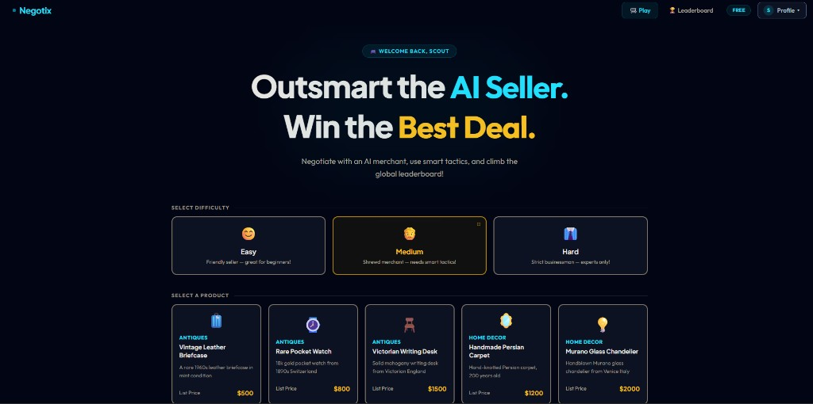
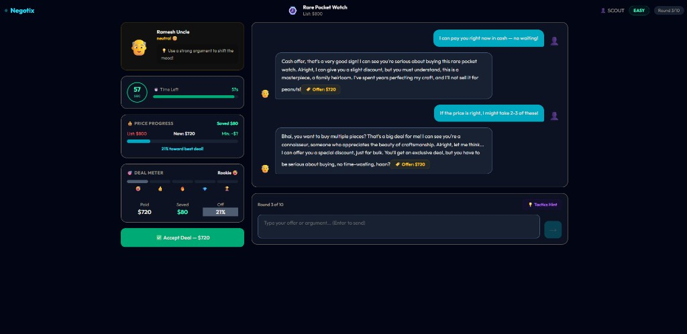
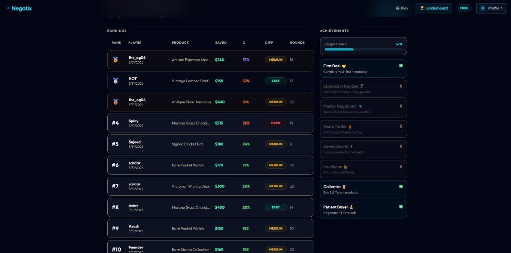
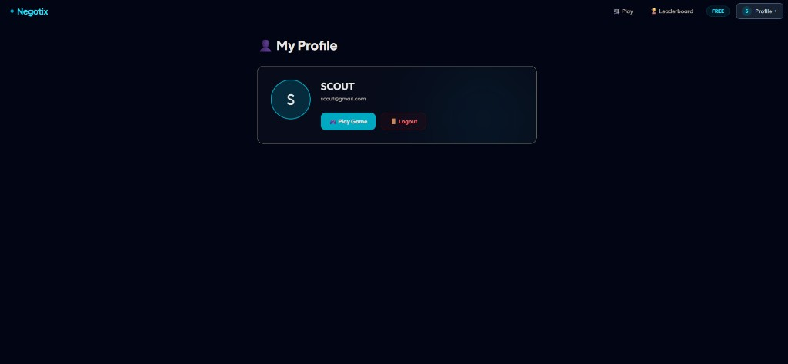

<h1 align="center">Negotix</h1>

<p align="center">
  AI-powered negotiation game where players bargain with virtual sellers, improve their tactics, and compete on a live leaderboard.
</p>

<p align="center">
  <a href="https://negotix-h8c2.onrender.com/"><strong>Live Demo</strong></a>
</p>

<p align="center">
  
  
  
  
</p>

## About

Negotix turns negotiation into a game. Players choose a product, pick a difficulty level, and bargain with an AI seller that reacts with changing moods, offers, and tactics. Every completed deal can be saved to the leaderboard, while badges and achievements reward smart play.

## Screenshots

<p align="center">
  
</p>

<p align="center">
  
</p>

<p align="center">
  
  
</p>

## Features

- AI-powered seller chat with dynamic responses
- Multiple negotiation difficulty levels
- Product-based deal scenarios
- Live deal tracking with rounds, savings, and mood
- Leaderboard, badges, and achievements
- Login, registration, and protected profile routes

## Tech Stack

- `React` + `Vite` + `Tailwind CSS`
- `Node.js` + `Express`
- `MongoDB` + `Mongoose`
- `Groq`
- `JWT`

## Environment Variables

### `backend/.env`

```env
MONGO_URI=your_mongodb_connection_string
GROQ_API_KEY=your_groq_api_key
PORT=5000
FRONTEND_URL=http://localhost:5173
JWT_SECRET=your_jwt_secret
```

### `frontend/.env`

```env
VITE_API_URL=http://localhost:5000
```

## Run Locally

### Backend

```bash
cd backend
npm install
npm run dev
```

### Frontend

```bash
cd frontend
npm install
npm run dev
```

## Project Structure

```text
NEGOTIX/
├── frontend/
├── backend/
└── docs/
```

## Author

**Prathmesh Kharwade**
